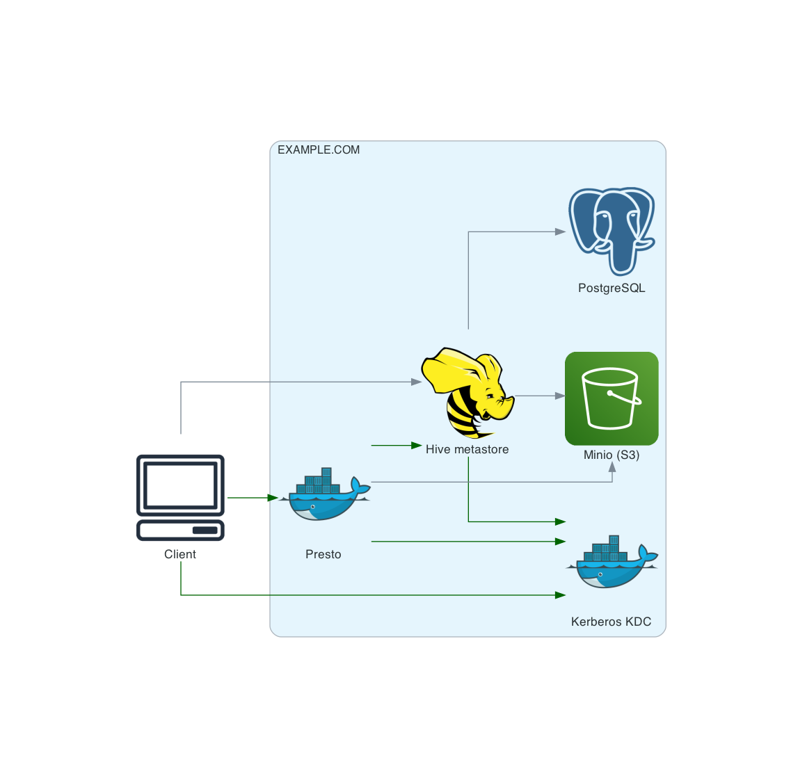

# Hive/Presto with Kerberos

A development environment consisting of:
 - [Apache Hive HCatalog  (metastore)](https://cwiki.apache.org/confluence/display/Hive/HCatalog)
 - [Trino](https://trino.io/) (formerly PrestoSQL) 
 - [Minio](https://min.io/) - S3-compatible storage

Communication between the client and Presto and Presto and Hive is secured by Kerberos



## Usage

To start the environment, run:
```
./start.sh
```
To stop the environment and remove all volumes, run:
```
./stop.sh
```

**Utilities scripts**

The project includes several scripts that facilitate interaction with the environment, focusing on authorization:

- [hive.sh](./hive.sh) - runs Apache Hive management console.
- [kadmin.sh](./kadmin.sh) - runs Kerberos management console.
- [kdiag.sh](./kdiag.sh) - runs Kerberos diagnostics tool. See: [Troubleshooting with ``KDiag``](https://hadoop.apache.org/docs/current/hadoop-project-dist/hadoop-common/SecureMode.html#Troubleshooting_with_KDiag).
- [presto-send-query.sh](./presto-send-query.sh) - sends a SQL query using curl to Presto.
- [psql.sh](./psql.sh) - runs PostgresSQL console
- [mc.sh](./mc.sh) - runs Minio CLI tool

All arguments for these scripts are passed to the processes that support them, so that you can write scripts using them

To create a bucket, run:
```
./aws-cli.sh s3 mb "s3://hadoop-data"
```

## Tests

The environment is integration tested using ``test-*.sh`` scripts. You can check its health by running these scripts locally. This is also a good source of examples of how to use this environment.

## Troubleshooting

To print more verbose logs in ``hive.sh``, add `-hiveconf hive.root.logger=DEBUG,console` argument.
````shell script
./hive.sh -hiveconf hive.root.logger=DEBUG,console -e "DROP TABLE employee"
````

To print all requests to minio server, run:
```shell script
./mc.sh admin trace local
```